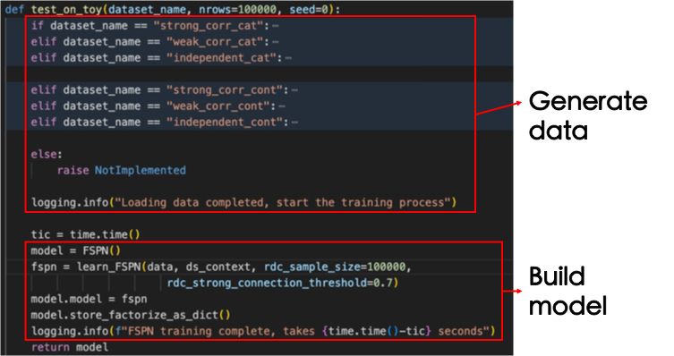
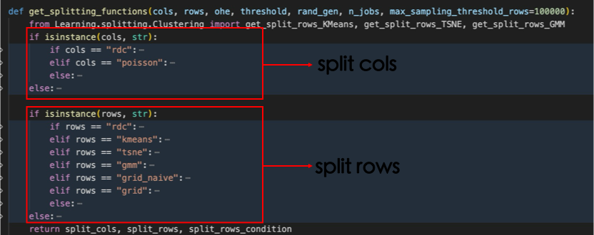

# Log

- **10/15/2024**

  [FSPN](asset/doc/FSPN-A_New_Class_of_Probabilistic_Graphical_Model.pdf) is short for "factorize-sum-split-product networks", is a new type of probabilistic graphical models (PGMs), which aims at increasing accuracy and decreasing inference time. Existing SPN models mostly base on tree structure and they are hard to learn with huge model size. FSPN is an optimization on SPN.

  `conda env create -f environment.yml` failed, so I build up my environment manually. 
  ``` bash
  # build fspn environment
  conda create -n fspn python=3.7
  pip install [packages in environment.yaml]
  pip install -r requirements.txt # requirements.txt由environment.yaml提取而成
  conda activate fspn
  ```
  Why python3.7? See [stack overflow](https://stackoverflow.com/questions/66174862/import-error-cant-import-name-gcd-from-fractions), fractions.gcd dosen't run on version 3.9 and later versions.

  ```bash
  # run fspn
  conda activate fspn
  python test_training.py --dataset strong_corr_cat
  ```
  When run the above code, a [logs](logs/) folder will be generated. You can see a [example log file](logs/strong_corr_cat_20241015-160831.log). The cmd `python test_training.py --dataset strong_corr_cat` means run a experiment on toy data and train a fspn model on the toy data.

  

  ``` python 
  # leaern_FSPN
  def learn_FSPN(
    data,
    ds_context,
    cols="rdc",
    rows="grid_naive",
    threshold=0.3,
    rdc_sample_size=50000,
    rdc_strong_connection_threshold=0.75,
    multivariate_leaf=True,
    ohe=False,
    leaves=None,
    leaves_corr=None,
    memory=None,
    rand_gen=None,
    cpus=-1,
  ):
      if leaves is None:
          leaves = create_histogram_leaf

      if leaves_corr is None:
          leaves_corr = create_multi_histogram_leaf

      if rand_gen is None:
          rand_gen = np.random.RandomState(17)

      def learn_param(data, ds_context, cols, rows, threshold, ohe):
          split_cols, split_rows, split_rows_cond = get_splitting_functions(cols, rows, ohe, threshold, rand_gen, cpus,
                                                                            rdc_sample_size)

          return learn_structure(data, ds_context, split_rows, split_rows_cond, split_cols, leaves, leaves_corr,
                                    threshold=threshold, rdc_sample_size=rdc_sample_size, 
                                    rdc_strong_connection_threshold=rdc_strong_connection_threshold,
                                    multivariate_leaf=multivariate_leaf)

      if memory:
          learn_param = memory.cache(learn_param)

      return learn_param(data, ds_context, cols, rows, threshold, ohe)
  ```

  ```python
  # get_splitting_functions
  def get_splitting_functions(cols, rows, ohe, threshold, rand_gen, n_jobs, max_sampling_threshold_rows=100000):
    from Learning.splitting.Clustering import get_split_rows_KMeans, get_split_rows_TSNE, get_split_rows_GMM
    if isinstance(cols, str):
        if cols == "rdc":
            from Learning.splitting.RDC import get_split_cols_RDC_py, get_split_rows_RDC_py
            split_cols = get_split_cols_RDC_py(threshold, rand_gen=rand_gen, ohe=ohe, n_jobs=n_jobs,
                                               max_sampling_threshold_cols=max_sampling_threshold_rows)
        elif cols == "poisson":
            from Learning.splitting.PoissonStabilityTest import get_split_cols_poisson_py
            split_cols = get_split_cols_poisson_py(threshold, n_jobs=n_jobs)
        else:
            raise AssertionError("unknown columns splitting strategy type %s" % str(cols))
    else:
        split_cols = cols

    if isinstance(rows, str):
        if rows == "rdc":
            split_rows = get_split_rows_RDC_py(rand_gen=rand_gen, ohe=ohe, n_jobs=n_jobs)
            split_rows_condition = None
        elif rows == "kmeans":
            split_rows = get_split_rows_KMeans(max_sampling_threshold_rows=max_sampling_threshold_rows)
            split_rows_condition = get_split_rows_condition_KMeans()
        elif rows == "tsne":
            split_rows = get_split_rows_TSNE()
            split_rows_condition = get_split_rows_condition_TSNE()
        elif rows == "gmm":
            split_rows = get_split_rows_GMM()
            split_rows_condition = get_split_rows_condition_GMM()
        elif rows == "grid_naive":
            split_rows = get_split_rows_KMeans()
            split_rows_condition = get_split_rows_condition_Grid_naive()
        elif rows == "grid":
            split_rows = get_split_rows_KMeans(max_sampling_threshold_rows=max_sampling_threshold_rows)
            split_rows_condition = get_split_rows_condition_Grid()
        else:
            raise AssertionError("unknown rows splitting strategy type %s" % str(rows))
    else:
        split_rows = rows
    return split_cols, split_rows, split_rows_condition
  ```

  
# Original README

## This project implemented the proposed new architecture Factorized Sum-product Network (FSPN)

## Code structure
The overall structure was inspired and adapted from https://github.com/SPFlow/SPFlow. 
I directly reused some files and functions of this project as well. I thank the SPFlow authors for their excellent code.

This fspn folder contains six sub-folders namely: Algorithm, Data_prepare, Evaluation, Inference, Learning and Structures.
Learning contains the key file: structureLearning.py, which learns the FSPN from scratch using the data.
Structure defines the set of nodes (sum, product, factorize and leaf).

## How to do some simple experiment

Setup the environment using conda (some packages might not support Linux):
```
conda env create -f environment.yml
conda activate fspn
```
Navigate to the Evaluation folder and test the training process of FSPN on some toy datasets.
```
cd fspn/Evaluation
python test_training.py --dataset strong_corr_cat
```
The test_on_GAS.ipynb file provides a concrete example of how to use FSPN for cardinality estimation of a real-world dataset.

## Citation
If you find this project useful please cite our papers:
```
@article{wu2020fspn,
  title={FSPN: A New Class of Probabilistic Graphical Model},
  author={Wu, Ziniu and Zhu, Rong and Pfadler, Andreas and Han, Yuxing and Li, Jiangneng and Qian, Zhengping and Zeng, Kai and Zhou, Jingren},
  journal={arXiv preprint arXiv:2011.09020},
  year={2020}
}
```

```
@article{zhu2020flat,
  title={FLAT: Fast, Lightweight and Accurate Method for Cardinality Estimation},
  author={Zhu, Rong and Wu, Ziniu and Han, Yuxing and Zeng, Kai and Pfadler, Andreas and Qian, Zhengping and Zhou, Jingren and Cui, Bin},
  journal={VLDB},
  year={2021}
}
```
